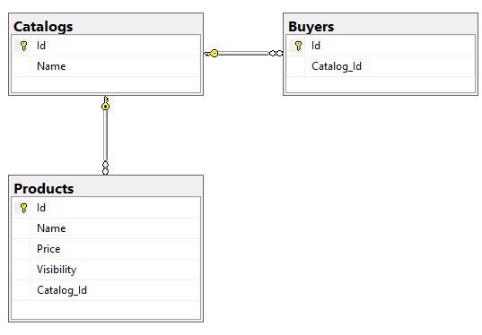

# Problem 2

## 1. Create tables
```
CREATE TABLE Catalogs (
    Id INT NOT NULL IDENTITY(1,1) PRIMARY KEY,
    Name varchar(255)
);

CREATE TABLE Products (
	Id INT NOT NULL IDENTITY(1,1) PRIMARY KEY,
	Name varchar(255),
	Price FLOAT,
	Visibility VARCHAR(15) NOT NULL CHECK (Visibility IN('default', 'catalog_members')),
	Catalog_Id INT,
	FOREIGN KEY (Catalog_Id) REFERENCES Catalogs(Id)
);

CREATE TABLE Buyers (
	Id INT NOT NULL IDENTITY(1,1) PRIMARY KEY,
	Catalog_Id INT,
	FOREIGN KEY (Catalog_Id) REFERENCES Catalogs(Id)
);
```

## 2. Insert mock data
```
INSERT INTO Catalogs ([Name])
VALUES ('Fruits'), ('Snacks'), ('Dairy'), ('Meat'), ('Care Products')

INSERT INTO Products ([Name] ,[Price] ,[Visibility] ,[Catalog_Id])
VALUES ('Apple', 0.1, 'default', 1),
	   ('Banana', 0.2, 'default', 1),
	   ('pineapple', 0.3, 'catalog_members', 1),
	   ('mango', 0.4, 'catalog_members', 1),
	   
	   ('Cheetos', 0.5, 'default', 2),
	   ('Doritos', 0.65, 'catalog_members', 2),
	   
	   ('Milk', 1, 'catalog_members', 3),
	   ('Cheese', 0.75, 'catalog_members', 3)

INSERT INTO Buyers ([Catalog_Id])
     VALUES (1), (2), (3), (4), (5)
```

## 3. Query list of products for a specific User

```
DECLARE @USER_CATALOG_ID INT
SET @USER_CATALOG_ID = (SELECT Catalog_Id from Buyers WHERE Buyers.Id = ##USER_ID##)

SELECT * FROM Products
WHERE Products.Visibility = 'default' OR Products.Catalog_Id = @USER_CATALOG_ID
```
All that is needed is to replace `##USER_ID##` For the ID of the user needed

In a real-world application, we would use an ORM (like SQLAlchemy, or Entity Framework) to abstract this.


## Diagram

